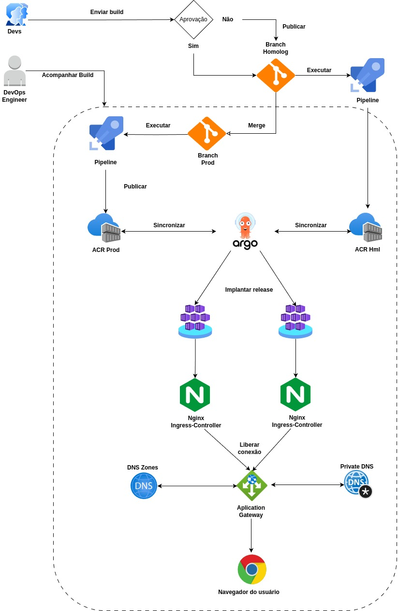
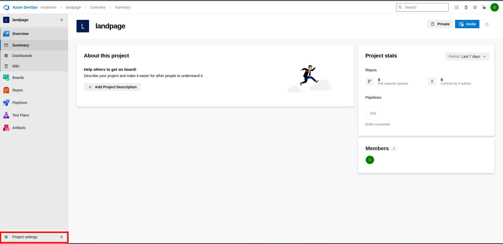
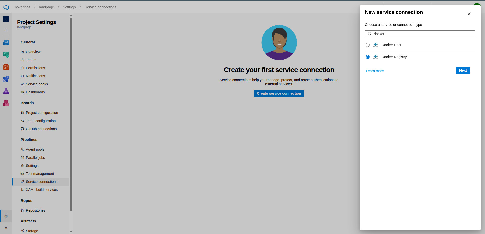
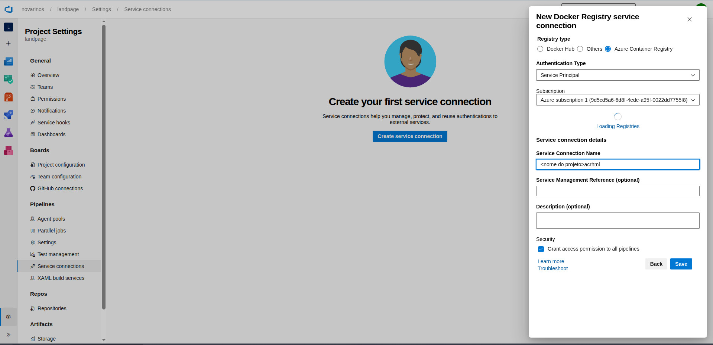

# Arquitetura de CI/CD e Infraestrutura Cloud

Este repositório documenta o fluxo de **Integração e Entrega Contínua (CI/CD)** e a infraestrutura em nuvem utilizada no projeto, focada em automação via GitOps e segregação de ambientes.

---

## 🚀 Fluxo de Trabalho

O ciclo de vida da aplicação segue quatro etapas principais:

### 1. Desenvolvimento e Qualidade
* **Envio de Build:** O processo inicia com o push de código pelos desenvolvedores.
* **Aprovação:** Existe um gate manual ou automático de aprovação. Se aprovado, o código segue para a branch de Homologação.
* **Monitoramento:** Engenheiros de DevOps acompanham a execução das pipelines para garantir a integridade do processo.

### 2. Integração Contínua (CI)
* **Pipelines de Build:** Execução automática de testes e empacotamento da aplicação em containers.
* **Azure Container Registry (ACR):** Armazenamento das imagens geradas, separadas por tags de **Hml (Homologação)** e **Prod (Produção)**.

### 3. Entrega Contínua (CD) com GitOps
* **Argo CD:** Atua como o cérebro da implantação, sincronizando o estado do repositório Git diretamente com o cluster.
* **Implantar Release:** Distribuição automatizada dos serviços para os pods do Kubernetes.

### 4. Camada de Rede e Acesso
* **Nginx Ingress-Controller:** Responsável pelo roteamento interno e gerenciamento de tráfego dentro do cluster.
* **Application Gateway:** Funciona como o firewall e balanceador de carga de entrada (WAF).
* **DNS (Public/Private):** Gerenciamento de domínios para acesso externo e interno seguro.

---

## 🛠️ Tecnologias Principais
* **Orquestração:** Kubernetes / Argo CD
* **Cloud:** Azure (ACR, Application Gateway, DNS Zones)
* **Web Server:** Nginx
* **CI Tool:** Azure Pipelines
<br>
<br>
<br>
<br>
<p align="center">

</p>

---

## Estrutura de repositórios

```text
Projeto/                # Repositório central do projeto
├── Repositórios/
│   ├── pipelines-templates/
│   │   ├── buildAndPush.yml
│   │   └── checkoutAndCommit.yml
│   └── <nome do serviço>-service/
│       └── azure-pipeline.yaml

GitOps/
├── manifestos/
│   ├── <nome do serviço>-deployment.yaml
│   ├── <nome do serviço>-service.yaml
│   └── <nome do serviço>-ingress.yaml

```

---

## Configuração do service connections

### Passo 1: acesssar a configuração do seu projeto

<p align="center">
    
</p>

### Passo 2: no menu a esquerda clicar em service connections

<p align="center">
    
</p>

### Passo 3: procurar docker registry e depois clicar no botão next

<p align="center">
    
</p>

### Passo 4: preencher as informações conforme a imagem abaixo (será solicitado autenticação com a sua conta azure) e depois é só salvar

<p align="center">
    
</p>